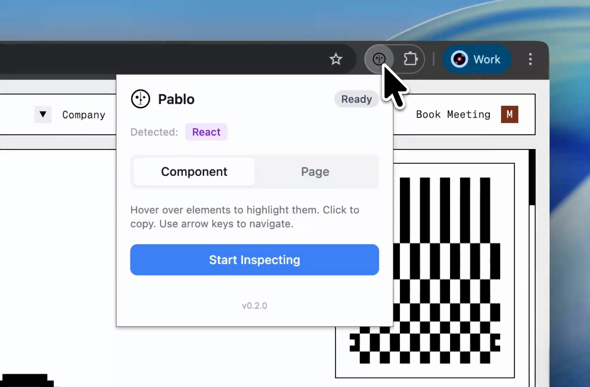

<p align="center">
  
</p>

# Pablo

Copy UI from the web.

Pablo is a Chrome extension that lets you hover an element, click it, and copy clean HTML + CSS to your clipboard.

[Watch demo](./web/public/demo.mp4) · [Chrome Web Store](https://chromewebstore.google.com) · [Website](https://getpablo.dev)

[](./web/public/demo.mp4)

## Install

```bash
pnpm install
pnpm build:ext
```

Then load `extension/dist` in `chrome://extensions` with Developer mode enabled.

## Develop

```bash
pnpm dev:ext
pnpm dev:web
```

## License

[MIT](./LICENSE)
